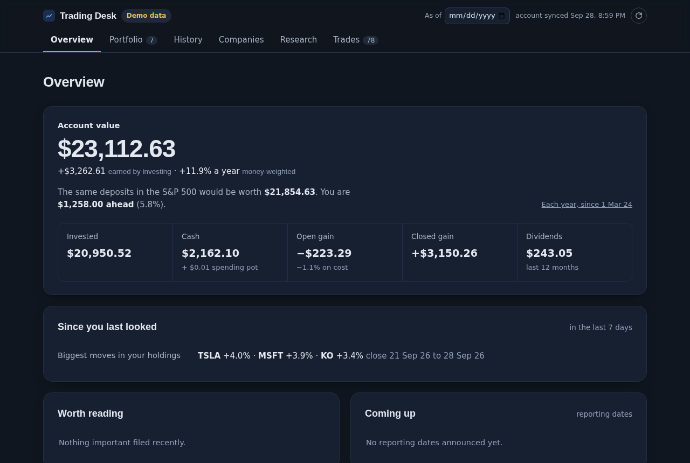

# Public Trading Desk

A research desk for your own investing that runs on your own computer. It reads your
brokerage account and public company data, and shows what you own, what it has earned
against the S&P 500, what each company files and reports, and what published research says
about it. Every figure is either a fact from your account or a calculation from a named
study, with its limits shown.

It works with **Trading 212**, **Alpaca**, **Interactive Brokers**, or **any broker that
exports a CSV file** of your history. It **only reads**: nothing in it can place an order
at any broker.



- **Local.** A small Python server on `127.0.0.1` serves the page. Your account data, keys and
  notes stay on your computer and are never sent to the page's scripts, logged or committed.
- **No dependencies.** Python 3.9 or later, standard library only. Nothing to `pip install`.
- **Tested.** Around 600 tests, no network or keys needed. A simulated account whose truth is
  known to the cent is fed through every broker's format and must come out right.

## Try it in a minute: the demo

The demo is a made-up account with made-up prices. It needs no keys and no network.

```bash
git clone https://github.com/jpselwan123/public-trading-desk.git ~/trading-desk
cd ~/trading-desk
./desk.sh --demo
```

The page opens at <http://127.0.0.1:8935/>. It is the same page your own account gets.

Works on macOS and Linux. On Windows, use WSL. On a Mac, `./native_app/build.sh --install`
also builds a small **Trading Desk.app** for the Dock (it expects the desk in `~/trading-desk`).

## Your own account

1. Copy the settings file and keep it private:
   ```bash
   cp .env.example .env && chmod 600 .env
   ```
2. **Your broker.** Set `BROKER` in `.env` and add its keys. Trading 212 is the default.
   [`docs/BROKERS.md`](docs/BROKERS.md) has each broker's steps:
   - **Trading 212:** an API key with *Account data, Portfolio, History* ticked and *Orders*
     left unticked.
   - **Alpaca:** an API key pair (live or paper).
   - **Interactive Brokers:** a Flex Web Service token and an Activity Flex Query.
   - **Any other broker:** its whole history exported as CSV, saved as `account.csv`.
3. **Company data.** These sources are free and need no card:
   - `SEC_CONTACT`: your email address. The SEC asks automated requests to name a contact. It
     is sent only to the SEC.
   - `TIINGO_API_KEY` from [tiingo.com](https://www.tiingo.com): daily prices.
   - `FINNHUB_API_KEY` from [finnhub.io](https://finnhub.io): results dates, estimates and news.
   - `OPENAI_API_KEY` is optional, for plain-English company summaries. It is billed to you.
4. Start the desk and press the round sync button:
   ```bash
   ./desk.sh
   ```
   The first sync reads your whole history, which can take a few minutes. Later syncs fetch
   only what is new.

`python3 doctor.py` checks the set-up. It says which keys are set (never their values), asks
each source once, and reports what each update did. Its report contains nothing private.

## What is on the page

Six tabs:

- **Overview** — what the account is worth, beside the same deposits put into the S&P 500 on
  the same days. What is new since you last looked: important filings, insider buys, rating
  changes, the biggest moves. It also shows the checks of the desk's figures against your
  broker's.
- **Portfolio** — holdings, what you own by industry, what investing has cost (fees and tax
  withheld from dividends), dividends and cash.
- **History** — the account year by year: money in and out, what it earned, and its return
  beside the S&P 500 with the same money. Each past year-end is rebuilt from the record.
- **Companies** — the companies you follow (up to 15) and every US company you hold:
  - a card for each: the desk's rating with every part of it, and the price against the
    company's own five years of earnings;
  - figures from its SEC filings, two published scoring models, and its rank in its industry;
  - how accurate the analysts' estimates of it have been;
  - its filings in plain words, and its news beside each day's move against the market.
- **Research**:
  - the desk's Buy list;
  - trading rules tested on real history after costs, with their honest results;
  - the rating's own track record;
  - a screener over every US company that files with the SEC.
- **Trades**:
  - a check before a trade: a ticker and an amount give the facts;
  - every real trade, and whether it beat doing nothing;
  - your habits, measured as published studies measured everyone's;
  - a practice portfolio with pretend money at real prices.

Any day can also be viewed as it was: each figure is cut to what was known on that day.

## The desk's rating

`rating.py` gives a US company **Buy, Hold or Sell**. It uses seven published measures,
grouped into four themes:
- value: book to market, and share issuance;
- momentum;
- quality: gross profitability;
- accruals.

The themes are those of the most thorough re-test of such findings (Jensen, Kelly & Pedersen
2023). Each measure is one that also held when Hou, Xue & Zhang (2020) re-tested 452 findings.

**How a rating is made:**
1. Each measure is placed against NYSE-listed companies, as the papers set their breakpoints.
2. The places are averaged within each theme.
3. The four themes are averaged with equal weights.
4. The top third is Buy and the bottom third is Sell.

**Its record.** Every rating is logged and scored against the market 3, 6 and 12 months on,
and a fixed random sample of 200 NYSE companies is rated alongside as its fair record.
[`docs/RATING.md`](docs/RATING.md) set out how the rating will be judged before there was
any result.

**Its limits.** The rating ranks groups of companies by what research found on average. It is
not a forecast for any one company, and published effects shrink once they are known.

**Nothing else advises.** There are no target prices and no "you should". The AI summaries are
told never to say buy or sell. Analysts' ratings are shown as other people's opinions, with
their known bias towards "buy".

## Built on published evidence

Every threshold and rule that could steer a decision comes from a published study, or is marked
as the desk's own choice and why. [`docs/EVIDENCE.md`](docs/EVIDENCE.md) is the register.

- **Intervals.** Any count read as evidence ("up after 7 of 10 filings") carries its interval.
- **Colour.** Colour says what kind of number a figure is, never whether it is good: there is
  no green or red on returns.
- **Rule tests.** Trading rules are tested the strict way:
  - a pre-registered search ([`PREREGISTRATION.md`](PREREGISTRATION.md)) over a fixed
    universe;
  - only the held-out last 30% of the history is reported;
  - costs are always applied;
  - p-values come from a block bootstrap and are corrected for testing many rules.

**The result so far: no rule showed an edge this test could detect.** Two searches tested 8
rules over 52 rule and fund pairs:
- The best result was holding the three strongest sectors: +1.33% a year over 8.4 held-out
  years, with a 95% range from −5.6% to +7.7%.
- `power.py` plants edges of known size to see what the test can find. An edge needs to be
  around 18% a year to be caught 80% of the time after the correction, so smaller real edges
  may have been missed.

## Accuracy

At every build, `checks.py` rebuilds these figures from your broker's own records and sets
each beside the broker's figure:
- the shares of each holding;
- cash and the total;
- closed gains;
- prices.

For a CSV export, which states no totals, the check says it cannot run.

The tests check the desk's figures against known answers:
- `tests/ledger.py` simulates accounts in dollars, euros and pounds, with splits, fees and
  withheld tax, whose truth is known to the cent;
- every account figure, statistic and split rule is checked against a second calculation or
  a published value.

The details are in [`docs/AUDIT.md`](docs/AUDIT.md).

## Privacy

- Your account data, notes, plans and keys are git-ignored, and stay on your computer.
- Your broker account number is dropped at sync.
- Before committing, `python3 scripts/privacy_scan.py --staged` checks for keys, account
  data and home-folder paths.
- Company data comes from the SEC, Tiingo and Finnhub. News also comes through Google News's
  search, which is unofficial and meant for personal reading.
- Your holdings and notes are sent nowhere. The one exception is a company summary or a week's
  news brief: when you ask for one, that company's figures or headlines go to OpenAI.

## More

- [`docs/BROKERS.md`](docs/BROKERS.md): connecting each broker, and the CSV format.
- [`docs/IPHONE.md`](docs/IPHONE.md): running the desk on an iPhone, in the a-Shell app.
- [`docs/ONE-DESK.md`](docs/ONE-DESK.md): opening your computer's desk from your phone
  through Tailscale.
- [`docs/THESES.md`](docs/THESES.md): writing down what you expect before a company reports,
  scored afterwards.
- `AUTO_UPDATE=1` in `.env` brings in new code from this repository each time the desk opens.
  It only fast-forwards, never over a file you have changed. It is off by default.

## Commands

```bash
./desk.sh [--demo]            # start the local server and open the page
./refresh.sh                  # sync the account and rebuild, from the terminal
python3 doctor.py             # is everything working? (--account also asks your broker)
python3 broker.py --check     # test the broker connection with one request
python3 news.py --follow NVDA # follow a company, then pull its filings
python3 screen.py --list      # the published screens; or: screen.py piotroski
python3 scores.py AAPL        # Piotroski F-score and Altman Z'', with every component
python3 value.py KO MSFT      # price ratios, checked against the company's own filed float
python3 forecasts.py AMD      # how accurate the analysts' estimates have been
python3 -m unittest discover -s tests -t tests
```

## Not investment advice

This is a tool for looking at your own account and at public information. It is not
investment advice, and its rating is a summary of published research, not a recommendation to
you. Past results, including every backtest here, do not promise future ones. Check anything
that matters against your broker's own statements.

## Licence

MIT. See [`LICENSE`](LICENSE).
