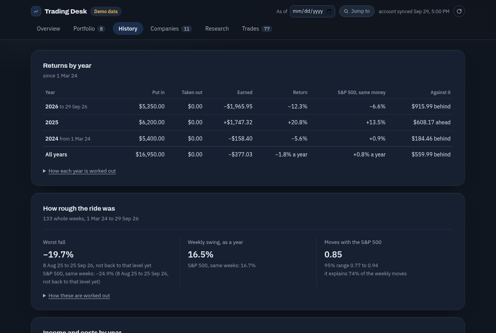
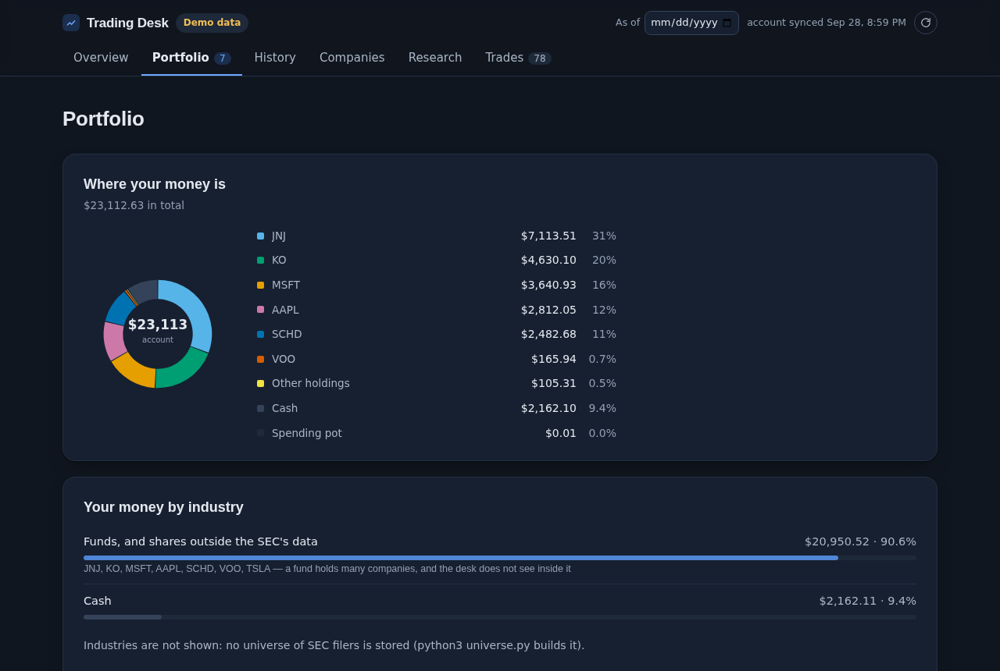
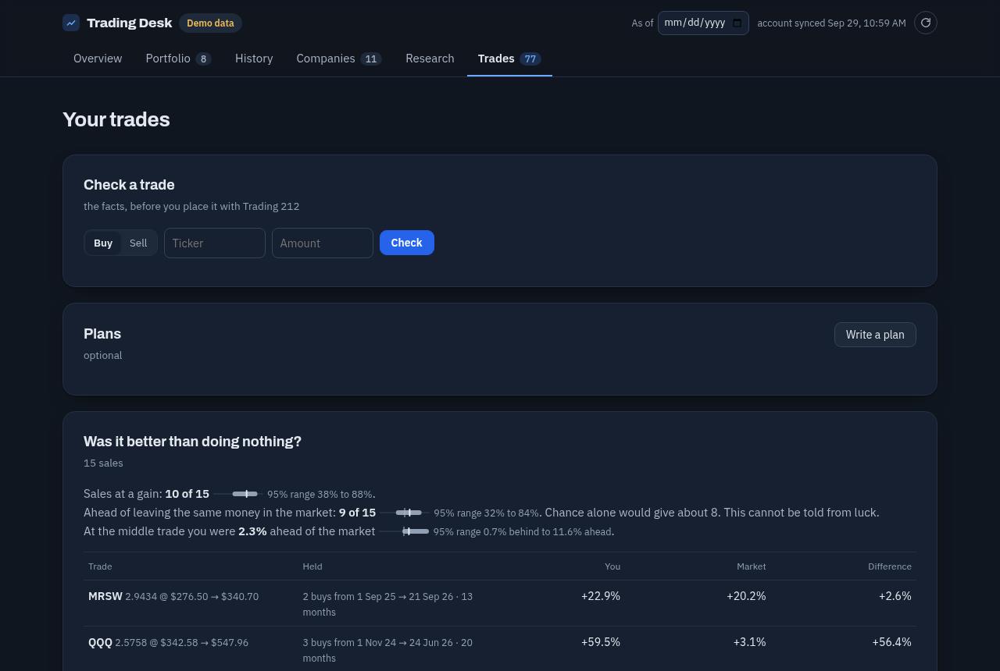

# Public Trading Desk

**A research desk for your own investing that runs on your own computer, and works with the broker you already use.**

[](https://github.com/jpselwan123/Public-Trading-Desk/actions/workflows/ci.yml)
[](LICENSE)


Connect **Trading 212**, **Alpaca**, **Interactive Brokers**, or **any broker that can export your history as a CSV file**. The desk reads your account (it can never trade) and shows what you own, what it has earned against the S&P 500, what the companies you hold are filing and reporting, and what published research says about them. Every figure is either a fact from your account or a calculation from a named study, shown with its limits. Everything runs on your machine.


*The demo account: made-up holdings and prices, so you can look around with no keys and no network.*

## Why use it

- **It checks its own arithmetic.** At every build, the desk rebuilds your shares, cash, total, closed gains and prices from your broker's raw records and sets each beside the broker's own figure. If one disagrees, it says which and by how much, so a mistake shows up instead of hiding.
- **Your data stays with you.** A small Python server on `127.0.0.1` serves the page, and the page loads nothing from the internet. Your account records, keys and notes live in files on your computer that git ignores. [What it connects to, host by host.](docs/NETWORK.md)
- **Read only, at every broker.** Nothing in the code can place, change or cancel an order. A test scans every module that reaches a broker for a write.
- **Nothing to install.** Python 3.9 or later, standard library only.
- **Evidence, not vibes.** Every rule and threshold comes from a published study, or is marked as the desk's own choice and why ([`docs/EVIDENCE.md`](docs/EVIDENCE.md)). Any count read as evidence carries its interval. Trading rules are tested the strict way, and the result so far is honest: [none beat luck](#what-the-rule-tests-found).
- **Tested.** Over 600 tests, with no network or keys. A simulated account whose right answers are known to the cent is fed through each broker's own format and has to come out right.

## Can you trust it with your account?

You shouldn't have to take anyone's word, mine included, so the desk is built to be checked and to need as little from you as possible:

- **Start with nothing.** `./desk.sh --demo` needs no keys. A CSV export (`BROKER=csv`) needs no key and no connection to your broker at all. Only then, if you want, add an API key.
- **Give it a key that can't trade.** A Trading 212 key made without the *Orders* permission is refused by Trading 212 itself if anything tried to trade, whatever the code does. Interactive Brokers' Flex reports have no trading access. Alpaca has no read-only key, so try it on a paper account first.
- **There is no service.** No website to sign up to, no account, no server run by the author, no analytics or telemetry. The desk is a program on your computer serving a page to your own browser, and the page loads nothing from the internet.
- **Every destination is listed.** [`docs/NETWORK.md`](docs/NETWORK.md) is the complete list of hosts the desk talks to, what each is sent and when. A test fails if the code gains a destination that isn't listed there.
- **It is small enough to read.** Standard library only, so there are no hidden dependencies, and the broker readers are a few hundred lines each. A test scans them for anything that could place an order.
- **It stays as you left it.** Code updates are off unless you turn on `AUTO_UPDATE`. Clone a commit you have read and it only changes when you change it.

Nobody has audited this code but its author and its tests, and it is early. If you read it and find something, that is exactly what [`SECURITY.md`](SECURITY.md) is for.

## Screenshots

| History: each year against the S&P 500 | Portfolio |
|---|---|
|  |  |



*Company cards, the news and the screener fill in once you add the free data keys below. They need live data, so the demo leaves them empty.*

## Try it in a minute

The demo needs no keys and no network.

```bash
git clone https://github.com/jpselwan123/Public-Trading-Desk.git ~/trading-desk
cd ~/trading-desk
./desk.sh --demo
```

The page opens at <http://127.0.0.1:8935/>. It is the same page your own account gets.

Works on macOS and Linux. On Windows, use WSL. On a Mac, `./native_app/build.sh --install` also builds a small **Trading Desk.app** for the Dock (it expects the desk in `~/trading-desk`).

## Connect your broker

| Broker | How it connects | Status |
|---|---|---|
| **Trading 212** | An API key with *Account data, Portfolio, History* ticked and *Orders* left unticked. Live or practice account. | The original reader: the desk was built on it. |
| **Alpaca** | An API key pair, live or paper. | Read against simulated Alpaca answers. |
| **Interactive Brokers** | A Flex Web Service token and an Activity Flex Query. Reports only, no trading access. | Read against simulated Flex statements. |
| **Any other broker** | Your whole history exported as a CSV, saved as `account.csv`. | Read against simulated exports. Strict: a row it cannot read stops the import and names the line. |

**On the status column, plainly:** all four readers are tested to the cent against simulated accounts in each broker's own format, but a test cannot tell whether a broker's real files match its documentation. The Overview's *Checks against your broker* row does that on your real account. If it says *agrees*, the desk has read your account correctly. If it doesn't, please [open an issue](https://github.com/jpselwan123/Public-Trading-Desk/issues/new/choose): fixing a reader for a real account is the most useful contribution there is. A CSV export states no totals of its own, so for CSV the checks say they cannot run, and the desk tells you to compare its total with your broker's once.

Step by step for each broker, and the CSV column format: [`docs/BROKERS.md`](docs/BROKERS.md). **Your broker isn't listed?** If it exports a CSV, it probably already works. If it has an API, adding it is a small, well-tested job: [`docs/ADDING-A-BROKER.md`](docs/ADDING-A-BROKER.md).

## Your own account, step by step

1. Copy the settings file and keep it private:
   ```bash
   cp .env.example .env && chmod 600 .env
   ```
2. Set `BROKER` in `.env` and add your broker's keys (see the table above and `docs/BROKERS.md`).
3. Add the company-data sources. All are free and need no card:
   - `SEC_CONTACT`: your email address. The SEC asks automated requests to name a contact. It is sent only to the SEC.
   - `TIINGO_API_KEY` from [tiingo.com](https://www.tiingo.com): daily prices.
   - `FINNHUB_API_KEY` from [finnhub.io](https://finnhub.io): results dates, estimates and news.
   - `OPENAI_API_KEY` is optional, for plain-English company summaries. It is billed to you.
4. Start the desk and press the round sync button:
   ```bash
   ./desk.sh
   ```
   The first sync reads your whole history, which can take a few minutes. Later syncs fetch only what is new. Company data (filings, prices, financials, ratings) then updates by itself when the desk opens and every 30 minutes while it is open.

`python3 doctor.py` checks the set-up. It says which keys are set (never their values), asks each source once, and reports what each update did. Its report contains nothing private, so it is safe to paste into an issue.

## What is on the page

Six tabs:

- **Overview**: what the account is worth, beside the same deposits put into the S&P 500 on the same days. What is new since you last looked: important filings, insider buys, rating changes, the biggest moves. The checks against your broker.
- **Portfolio**: holdings, what you own by industry, what investing has cost (fees and tax withheld from dividends), dividends and cash.
- **History**: the account year by year: money in and out, what it earned, and its return beside the S&P 500 with the same money. Each past year-end is rebuilt from the record and used only while the rebuild ties to your broker's total.
- **Companies**: the companies you follow (up to 15) and every US company you hold:
  - a card for each, with the desk's rating and every part of it, and the price against the company's own five years of earnings;
  - figures from its SEC filings, two published scoring models (Piotroski, Altman) and its rank in its industry;
  - how accurate the analysts' estimates of it have been;
  - its filings in plain words, and its news beside each day's move against the market, with days that moved unusually marked.
- **Research**:
  - the desk's Buy list;
  - trading rules tested on real history after costs;
  - the rating's own track record;
  - a screener over every US company that files with the SEC.
- **Trades**:
  - a check before a trade: a ticker and an amount give the facts (your holding and its industry before and after, the rating, next results, your fees, dividend and tax withheld);
  - every real trade, and whether it beat doing nothing;
  - your habits, measured as published studies measured everyone's (how much you trade, whether you sell winners too soon, what replaces what you sell);
  - a practice portfolio with pretend money at real prices.

Any day can also be viewed **as it was**: every figure is cut to what was known on that day.

It also runs on an iPhone in the free a-Shell app ([`docs/IPHONE.md`](docs/IPHONE.md)), or your computer's desk can be opened from your phone through Tailscale ([`docs/ONE-DESK.md`](docs/ONE-DESK.md)).

## The desk's rating

`rating.py` gives a US company **Buy, Hold or Sell**. It uses seven published measures, grouped into four themes:

- value: book to market, and share issuance;
- momentum;
- quality: gross profitability;
- accruals.

The themes are those of the most thorough re-test of such findings (Jensen, Kelly & Pedersen 2023). Each measure is one that also held when Hou, Xue & Zhang (2020) re-tested 452 findings.

**How a rating is made.**
1. Each measure is placed against NYSE-listed companies, as the papers set their breakpoints.
2. The places are averaged within each theme.
3. The four themes are averaged with equal weights.
4. The top third is Buy and the bottom third is Sell.

**Its record.** Every rating is logged and scored against the market 3, 6 and 12 months on. A fixed random sample of 200 NYSE companies is rated alongside as its fair record. [`docs/RATING.md`](docs/RATING.md) set out how the rating will be judged before there was any result.

**Its limits.** The rating ranks groups of companies by what research found on average. It is not a forecast for any one company, and published effects shrink once they are known. It never places an order, and nothing else in the desk gives advice: no target prices, no "you should". The AI summaries are told never to say buy or sell, and analysts' ratings are shown as other people's opinions, with their known bias towards "buy".

## What the rule tests found

Trading rules are tested the way the strictest research asks: a pre-registered search ([`PREREGISTRATION.md`](PREREGISTRATION.md)) over a fixed universe, only the held-out last 30% of the history reported, costs always applied, and p-values from a block bootstrap corrected for testing many rules.

**The result so far: no rule showed an edge this test could detect.** Two searches tested 8 rules over 52 rule and fund pairs. The best result, holding the three strongest sectors, came out at +1.33% a year over 8.4 held-out years, with a 95% range from −5.6% to +7.7%.

That is a narrower claim than "no rule works". `power.py` plants edges of known size to see what the test can find: an edge needs to be around 18% a year to be caught 80% of the time after the correction, so smaller real edges may have been missed. A tool that tells you what it could not find is one you can trust when it does find something.

## Accuracy

At every build, `checks.py` rebuilds these from your broker's own records and sets each beside the broker's figure: the shares of each holding, cash and the total, closed gains, and prices. The tests go further:

- `tests/ledger.py` simulates accounts in dollars, euros and pounds, with splits, fees, withheld tax and a London-listed line, whose truth is known to the cent;
- every account figure, statistic and split rule is checked against a second calculation or a published value.

The audit that came out of this, including the errors it found and fixed, is in [`docs/AUDIT.md`](docs/AUDIT.md).

## Privacy and data

- Your account data, notes, plans and keys are git-ignored, and stay on your computer.
- Your broker account number is dropped at sync.
- Before committing, `python3 scripts/privacy_scan.py --staged` checks for keys, account data and home-folder paths.
- **What leaves your machine.** Your balances, notes and trades are sent nowhere. To fetch prices, filings and news, the desk asks the SEC, Tiingo, Finnhub and Google News's search about the tickers you hold or follow, so those services can see those requests. That is inherent in getting the data, and it happens under your own keys. Google News's search is unofficial and meant for personal reading. If you ask for a company summary or a week's news brief, that company's figures or headlines go to OpenAI.

## FAQ

**Can it place a trade?** No. There is no order code in this repository. Trading 212 is read through an allowlisted `GET`. Interactive Brokers is read through Flex reports, which give no trading access. Alpaca's keys can trade, and Alpaca offers no read-only key, so keep `.env` private (the desk's Alpaca client reaches only three read paths, and a test holds it there).

**Does it work outside the US?** It reads accounts in any currency and shows lines listed anywhere. Ratings, prices, filings and the screener cover US-listed companies only, because that is where the SEC data is. A line listed elsewhere is shown from your broker's own figures.

**What does it cost?** Nothing. Tiingo and Finnhub have free keys, and the SEC is free. OpenAI is optional and billed to you.

**Why is there a Buy/Hold/Sell at all, if it isn't advice?** Because a summary of what published factor research found, scored against the market with its record on display, is more useful than nothing, and more honest than a hidden score. Read *Its limits* above before leaning on it.

**Where are my notes and plans kept?** In `journal.json`, `plans.json` and `theses.json` next to the code, on your computer. Plans and theses are write-once: you can't edit them afterwards, on purpose.

**Could I commit my account data to GitHub by mistake?** The private files are all in `.gitignore`, and `scripts/privacy_scan.py` fails if one is staged.

## Contributing

Contributions are welcome, and the most valuable is **a broker that works on a real account**. Try your broker, run `python3 doctor.py --account`, and tell us what the checks say. To add a new one, follow [`docs/ADDING-A-BROKER.md`](docs/ADDING-A-BROKER.md). See [`CONTRIBUTING.md`](CONTRIBUTING.md) for how to run the tests and what a change must keep true. Security issues: [`SECURITY.md`](SECURITY.md).

If the desk is useful to you, a star helps other people find it.

## Commands

```bash
./desk.sh [--demo]            # start the local server and open the page
./refresh.sh                  # sync the account and rebuild, from the terminal
python3 doctor.py             # is everything working? (--account also asks your broker)
python3 broker.py --check     # test the broker connection with one request
python3 news.py --follow NVDA # follow a company, then pull its filings
python3 screen.py --list      # the published screens; or: screen.py piotroski
python3 scores.py AAPL        # Piotroski F-score and Altman Z'', with every component
python3 value.py KO MSFT      # price ratios, checked against the company's own filed float
python3 forecasts.py AMD      # how accurate the analysts' estimates have been
python3 -m unittest discover -s tests -t tests
```

`AUTO_UPDATE=1` in `.env` brings in new code from this repository each time the desk opens. It only fast-forwards, never over a file you have changed. It is off by default.

## How it was made

Written with the help of [Claude Code](https://claude.com/claude-code), Anthropic's coding assistant, and kept honest by its tests: over 600 of them, plus checks against known answers. That is a reason to read the code rather than to skip it, which is why [what it connects to](docs/NETWORK.md) and how to check it are written down.

## Not investment advice

This is a tool for looking at your own account and at public information. It is not investment advice, and its rating is a summary of published research, not a recommendation to you. Past results, including every backtest here, do not promise future ones. Check anything that matters against your broker's own statements.

## Licence

MIT. See [`LICENSE`](LICENSE).
